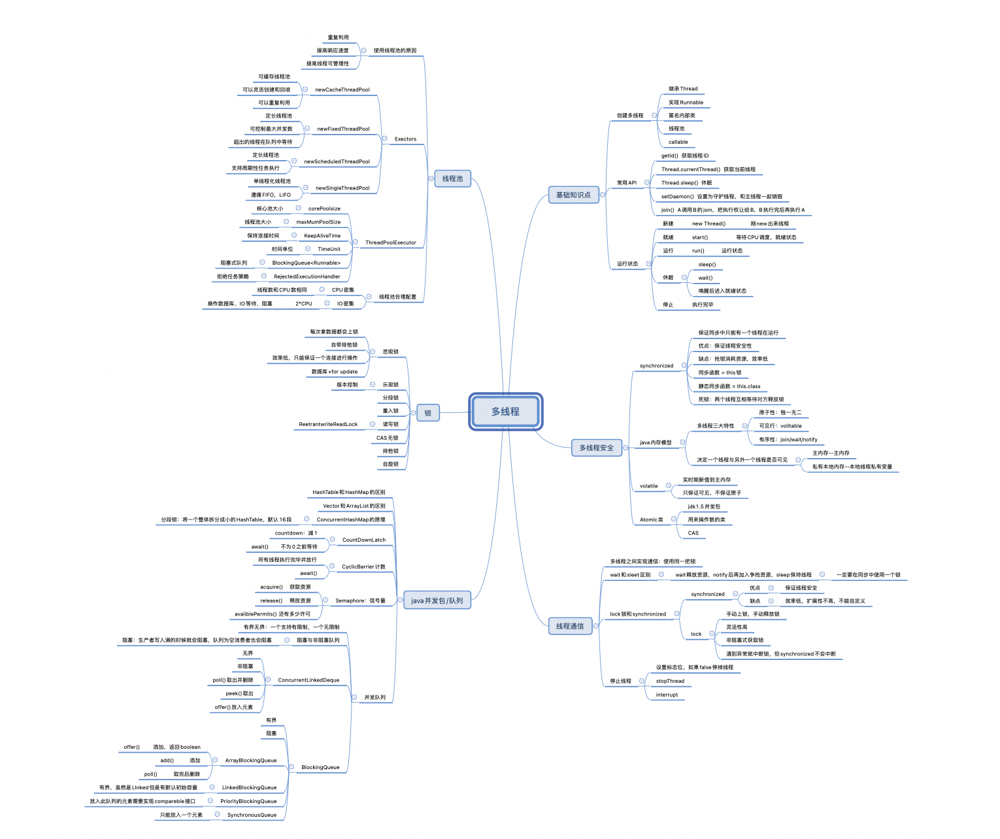
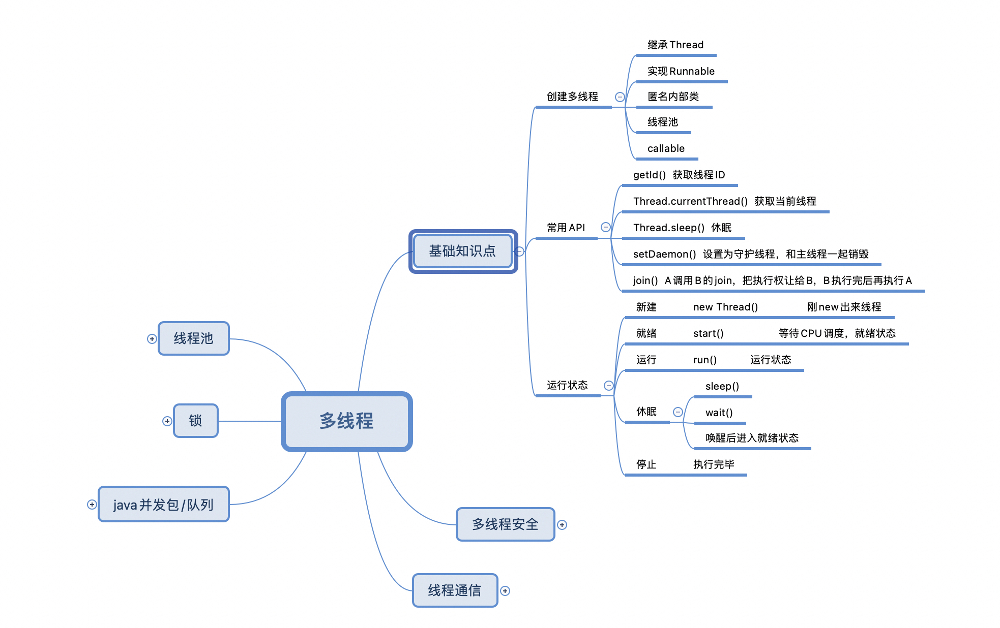
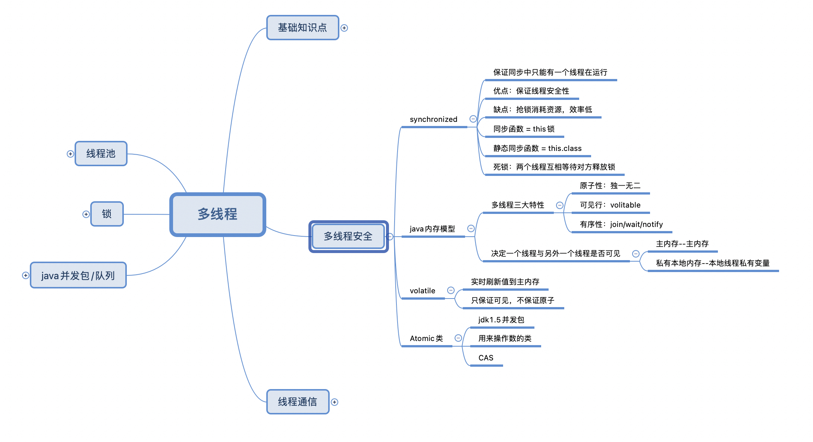
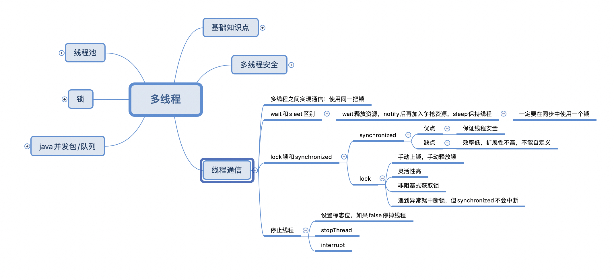
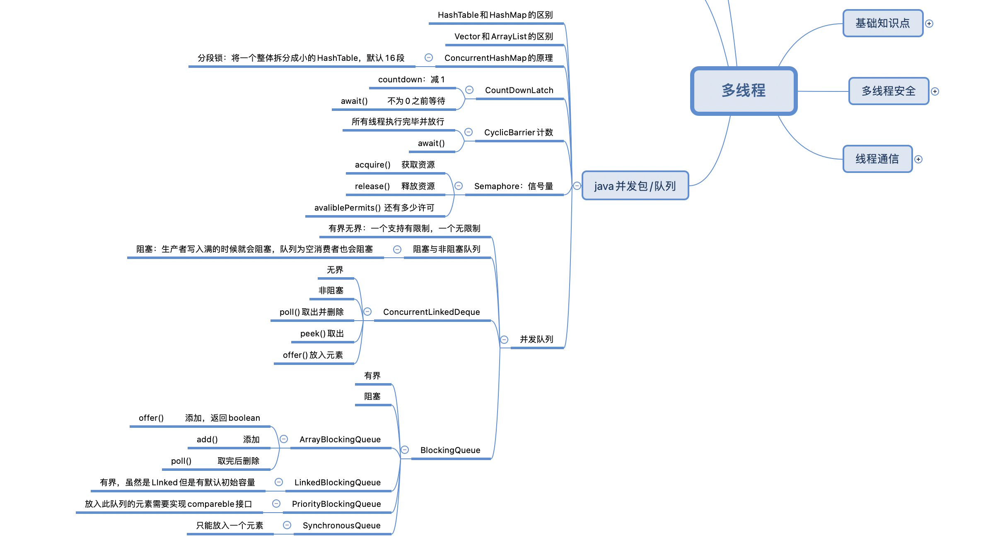
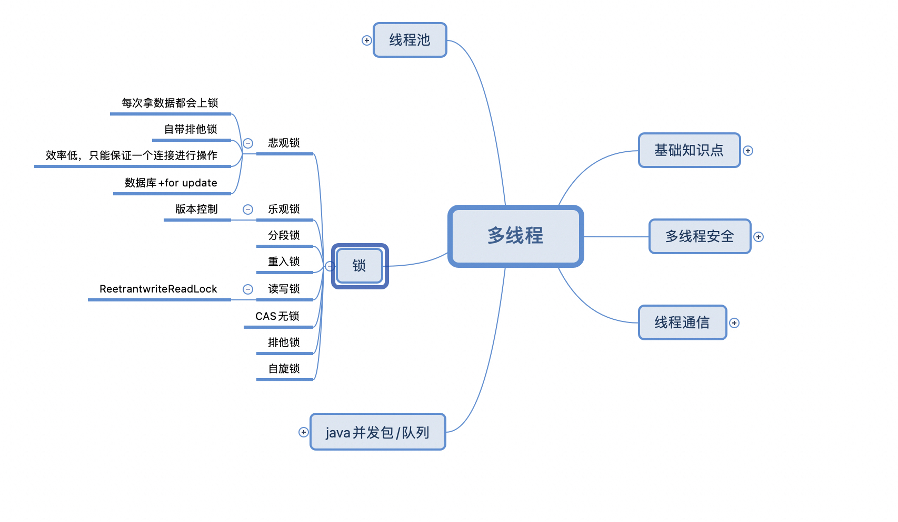
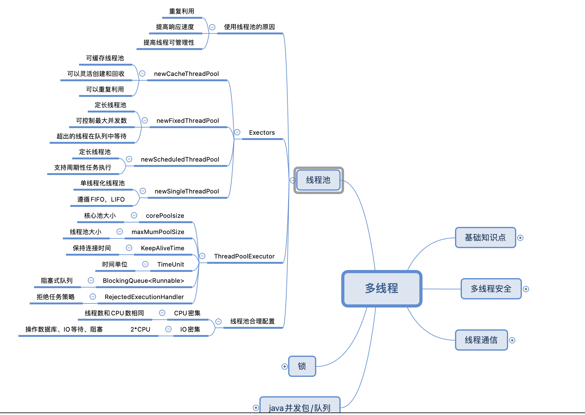

# GeekBangCourseCode

### Week01
自定义类加载器：/01_jvm/src/MyClassLoader.java

jvm内存和启动参数对应关系：/otherFiles/启动参数对应内存结构.pdf

### Week02

不同GC和堆内存总结：

（tips：MacBook Pro、8G双核）

- 串行GC
  
  概念：
  
  单线程垃圾收集器，不能进行并行处理，会触发STW，停止所有应用线程。
  
  启动参数： 
  
      -XX:+UseSerialGC

  过程：
  
  串行GC对年轻代使用mark-copy算法（标记-复制），对老年代使用mark-sweep-compact（标记-清除-整理）算法。

  特点：
  
  这种GC算法不能充分利用到多核CPU的优势，在垃圾收集时只能使用单个核心。只适合堆内存不大的JVM，而且是单核CPU场景，比方说客户端应用。

  日志分析：
  
  启动示例程序：java -Xmx256m -Xms256m -XX:+PrintGCDetails -XX:+PrintGCDateStamps -XX:-UseAdaptiveSizePolicy -XX:+UseSerialGC GCLogAnalysis
  GC日志：(截取部分)
  
      2021-08-13T20:41:02.014-0800: [GC (Allocation Failure) 2021-08-13T20:41:02.014-0800: [DefNew: 78651K->8703K(78656K), 0.0265053 secs] 212477K->165635K(253440K), 0.0265543 secs] [Times: user=0.02 sys=0.01, real=0.03 secs]
      -- 解释
      2021-08-13T20:41:02.014-0800 是GC事件开始时间；
      这条日志是一次MinorGC，即新生代GC，触发原因是Allocation Failure（分配空间失败）；
      DefNew为垃圾收集器名称，表明在年轻代中使用。78651K->8703K(78656K)表明GC前后分别的内存大小，以及年轻代总的内存大小，耗时0.0265053秒；212477K->165635K(253440K)表明GC前后整个堆内存的大小变化及总的堆内存大小，这次GC共耗时0.0265543秒；
      从新生代减少的空间和整个堆内存占用减少的空间可以间接知道有多少对象从年轻代晋升到了老年代。
  
      [Times: user=0.02 sys=0.01, real=0.03 secs]是GC时间的持续时间：
      user – 在此次垃圾回收过程中, 所有 GC线程所消耗的CPU时间之和。
      sys – GC过程中中操作系统调用和系统等待事件所消耗的时间。
      real – 应用程序暂停的时间。因为串行GC只使用单线程, 因此 real time 等于 user 和 system 时间的总和。

      2021-08-13T20:41:02.052-0800: [GC (Allocation Failure) 2021-08-13T20:41:02.052-0800: [DefNew: 78655K->78655K(78656K), 0.0000215 secs]2021-08-15T20:41:02.052-0800: [Tenured: 156931K->168282K(174784K), 0.0423257 secs] 235587K->168282K(253440K), [Metaspace: 2562K->2562K(1056768K)], 0.0424106 secs] [Times: user=0.04 sys=0.00, real=0.04 secs]
      -- 解释
      这条日志是一次MajorGC，回收老年代，但通常伴随出现至少一次MinorGC，触发原因是Allocation Failure（分配空间失败）；
      DefNew：在年轻代进行了一次MinorGC，清空年轻代到0（！！！这里JVM的GC报告有问题，它误认为年轻代是完全填满的）
      Tenured：清理老年代空间的垃圾收集器名称, 收集算法为mark-sweep-compact
      Metaspace：此次Metaspace空间中没有收集到垃圾

      2021-08-13T20:41:02.154-0800: [Full GC (Allocation Failure) 2021-08-13T20:41:02.154-0800: [Tenured: 174759K->174708K(174784K), 0.0303033 secs] 253412K->196059K(253440K), [Metaspace: 2562K->2562K(1056768K)], 0.0303490 secs] [Times: user=0.03 sys=0.00, real=0.03 secs]
      -- 解释
      这条日志是一次FullGC，针对年轻代、老年代、元空间（jdk8及以上，jdk8以下为perm gen）的全局范围GC。

  疑问：
  
  三条日志里后两条是不是都是FullGC？标记FullGC的那条为什么只有Tenured没有DefNew？
  以上这样理解MinorGC和MajorGC、FullGC是否正确？

  
- 并行GC

  概念：
  
  多个GC线程并行执行，大幅减少GC时间

  启动参数： 
  
      -XX:+UseParallelGC
      -XX:+UseParallelOldGC
      -XX:+UseParallelGC -XX:+UseParallelOldGC
      指定线程数，默认为CPU内核数：
      -XX:ParallelGCThreads=***

  过程：
  
  在年轻代使用标记-复制算法，在老年代使用标记-清除-整理算法，年轻代和老年代的GC都会触发STW，暂停所有业务线程来执行垃圾收集。

  特点：

  适用于多核服务器，目标是增加吞吐量。GC期间，所有线程都并行做GC，所以业务暂停时间更短。
  两次GC间隔期间，不会有线程执行GC，不消耗任何资源。
  
  （JDK8默认使用ParallelGC）

  日志分析：（和串行GC类似）

  启动示例程序：java -Xmx512m -Xms512m -XX:+PrintGCDetails -XX:+PrintGCDateStamps -XX:-UseAdaptiveSizePolicy -XX:+UseParallelGC GCLogAnalysis
  
      2021-08-14T22:05:40.801-0800: [GC (Allocation Failure) [PSYoungGen: 152753K->21490K(153088K)] 433320K->345227K(502784K), 0.0267749 secs] [Times: user=0.03 sys=0.02, real=0.02 secs]
      --解释
      PSYoungGen，垃圾收集器名称，表示的是在年轻代使用的并行的标记复制，出现STW的垃圾收集器
      
      2021-08-14T22:05:40.829-0800: [Full GC (Ergonomics) [PSYoungGen: 21490K->0K(153088K)] [ParOldGen: 323736K->248231K(349696K)] 345227K->248231K(502784K), [Metaspace: 2562K->2562K(1056768K)], 0.0433909 secs] [Times: user=0.09 sys=0.00, real=0.05 secs]
      --解释
      Full GC (Ergonomics)：FullGC标志，原因是Ergonomics，即：JVM内部环境认为此时可以进行一次垃圾收集。

- CMS

  概念：
  
  CMS（Mostly Concurrent Mark and Sweep Garbage Collector），主要并发-标记-清除垃圾收集器。

  启动参数：

      -XX:+UseConcMarkSweepGC

  过程：

  对年轻代使用并行STW方式的标记-复制算法，对老年代主要使用并发标记-清除算法。

  6个阶段

  特点：

  1、不对老年代进行整理（compact），使用空闲列表管理内存空间回收。
  2、在标记-清除阶段的大部分工作与应用线程并发。
  
  通过以上两点避免老年代GC时间长。服务器为多核，且需要降低延迟，可选择CMS；但由于多数时间GC线程和业务线程并行，所以CMS的吞吐量会比ParallelGC差。

  CMS的GC线程会和应用线程抢CPU时间，默认情况CMS使用内核数1/4的并发线程。

  日志分析：

  启动示例程序：java -Xmx512m -Xms512m -XX:+PrintGCDetails -XX:+PrintGCDateStamps -XX:-UseAdaptiveSizePolicy -XX:+UseConcMarkSweepGC GCLogAnalysis

      2021-08-14T22:21:43.942-0800: [GC (Allocation Failure) 2021-08-14T22:21:43.942-0800: [ParNew: 157026K->17472K(157248K), 0.0406720 secs] 312955K->221342K(506816K), 0.0407204 secs] [Times: user=0.08 sys=0.02, real=0.04 secs]
      --解释
      ParNew：垃圾收集器名称。表示在年轻代中使用的并行的标记复制, STW垃圾收集器,配合老年代 Concurrent Mark-Sweep 的垃圾收集器。
      
      2021-08-14T22:21:43.983-0800: [GC (CMS Initial Mark) [1 CMS-initial-mark: 203870K(349568K)] 221569K(506816K), 0.0003561 secs] [Times: user=0.01 sys=0.00, real=0.00 secs]
      --解释
      CMS Initial Mark：CMS第一个阶段，标记所有的root及其直接引用（STW）
      203870K(349568K)：老年代当前使用量和总量
      221569K(506816K)：堆内存当前使用量和总量
  
      2021-08-14T22:21:43.983-0800: [CMS-concurrent-mark-start]
      --解释
      CMS第二阶段并发标记开始，这一阶段，遍历老年代并标记所有存活对象
  
      2021-08-14T22:21:43.988-0800: [CMS-concurrent-mark: 0.005/0.005 secs] [Times: user=0.00 sys=0.00, real=0.00 secs]
      --解释
      0.005/0.005 secs：这个阶段的持续时间，运行时间/相应的实际时间

      2021-08-14T22:21:43.988-0800: [CMS-concurrent-preclean-start]
      --解释
      CMS第三个阶段并发预清理开始。这个阶段会把引用关系发生变化的区域标记成"脏"区，即所谓的"卡片标记"

      2021-08-14T22:21:43.989-0800: [CMS-concurrent-preclean: 0.001/0.001 secs] [Times: user=0.00 sys=0.00, real=0.00 secs]
      --解释
      展示该阶段持续时间

      2021-08-14T22:21:43.989-0800: [CMS-concurrent-abortable-preclean-start]
      --解释
      CMS并发预清理阶段的子阶段：并发的可取消的预清理开始，此阶段的持续时间不确定，会循环做同样的事情，知道满足某些条件（存疑？）

      2021-08-14T22:21:44.155-0800: [GC (Allocation Failure) 2021-08-14T22:21:44.155-0800: [ParNew2021-08-14T22:21:44.229-0800: [CMS-concurrent-abortable-preclean: 0.004/0.240 secs] [Times: user=0.41 sys=0.06, real=0.24 secs]
      --解释
      老年代并发回收时，可能伴随多次年轻代的小型GC。
      
      2021-08-14T22:21:44.266-0800: [GC (CMS Final Remark) [YG occupancy: 17925 K (157248 K)]2021-08-14T22:21:44.266-0800: [Rescan (parallel) , 0.0010887 secs]2021-08-14T22:21:44.267-0800: [weak refs processing, 0.0000988 secs]2021-08-14T22:21:44.267-0800: [class unloading, 0.0004216 secs]2021-08-14T22:21:44.267-0800: [scrub symbol table, 0.0003362 secs]2021-08-14T22:21:44.268-0800: [scrub string table, 0.0001771 secs][1 CMS-remark: 335023K(349568K)] 352948K(506816K), 0.0022045 secs] [Times: user=0.00 sys=0.00, real=0.00 secs]
      --解释
      CMS第四个阶段最终标记。第二次STW也是最后一次，该阶段完成老年代中所有存活对象的标记。CMS会尝试在年轻代尽可能空的时候进行最终标记，以此避免多次STW
      YG occupancy: 17925 K (157248 K)：当前年轻代的使用量和总容量
      Rescan (parallel) , 0.0010887 secs：STW时重新扫描（并行执行），标记存活对象，耗时0.0010887 secs
      weak refs processing, 0.0000988 secs：处理弱引用的第一个子阶段，持续0.0000988 secs（没懂做了啥？）
      class unloading, 0.0004216 secs：第二个子阶段，卸载不使用的类
      scrub symbol table, 0.0003362 secs：清理持有class级别metadata的符号表
      scrub string table, 0.0001771 secs：清理持有class级别metadata的字符串对应的string tables
      335023K(349568K)：此阶段完成后老年代的使用量和总量
      352948K(506816K)：此阶段完成后堆内存的使用量和总量

      2021-08-14T22:21:44.268-0800: [CMS-concurrent-sweep-start]
      --解释
      CMS第五个阶段并发清除开始，删除未使用的对象，并回收其空间。

      2021-08-14T22:21:44.269-0800: [CMS-concurrent-sweep: 0.001/0.001 secs] [Times: user=0.00 sys=0.00, real=0.00 secs]
      2021-08-14T22:21:44.269-0800: [CMS-concurrent-reset-start]
      --解释
      CMS第六个阶段并发重置开始，重置CMS算法相关的内部数据，为下一次CMSGC循环作准备

      2021-08-14T22:21:44.269-0800: [CMS-concurrent-reset: 0.000/0.000 secs] [Times: user=0.00 sys=0.00, real=0.00 secs]

    疑问：
  
    1、最终标记里那几个子阶段做了啥，没找到满意的文章资料。不是很理解
    
    2、这么看来CMS最大的问题是不是就是老年代内存的碎片问题了呀，因为他没整理

- G1

  概念：

  Garbage First垃圾优先算法。

  启动参数：

      -XX:+UseG1GC
  
      设置预期G1每次GC的暂停时间，单位毫秒，默认200毫秒：
      -XX:MaxGCPauseMills

  过程：

  1、年轻代模式转移暂停
  
  2、并发标记

  3、转移暂停，混合模式

  特点：
  
  1、可以设置性能指标，指定在任意时间内，STW的时间不超过多少毫秒

  2、堆内存划分成多个可存放对象的小区块，每个小区块可能是Eden区，可能是Survivor区，也可能是old区，只有逻辑上的年轻代和老年代

  3、并发阶段估算每个小区块存活对象的总数，构建回收集（collection set），原则是垃圾最多的小区块会被最先收集--Garbage First

  日志分析：(遗留，还没做深入分析，待补充)

  启动示例程序：java -Xmx512m -Xms512m -XX:+PrintGC -XX:+PrintGCDateStamps -XX:-UseAdaptiveSizePolicy -XX:+UseG1GC GCLogAnalysis

  遗留问题：
  
  1、G1是怎么处理很大的对象的？

  2、什么情况下会发生G1的退化？

### Week03
代码所在包在week03模块

### Week04

多线程

### Week05

- [ ] 1.（选做）使 Java 里的动态代理，实现一个简单的 AOP。
---
- [x] 2.（必做）写代码实现 Spring Bean 的装配，方式越多越好（XML、Annotation 都可以）, 提交到 GitHub。

  方法1：通过xml配置
  
  week05/src/main/resource/beanConfig.xml
  
  方法2：通过java代码配置

  week05/src/main/java/com/gabriel/week05/beandemo/BeanConfig.java
  
  方法3：利用spring boot的注解自动装配

  week05/src/main/java/com/gabriel/week05/entity/School.java中：
  
  @Autowire通过类型注入Klass
  
  @Resource通过名称注入Student

---
- [ ] 3.（选做）实现一个 Spring XML 自定义配置，配置一组 Bean，例如：Student/Klass/School。
---
（选做，会添加到高手附加题）
- [ ] 4.1 （挑战）讲网关的 frontend/backend/filter/router 线程池都改造成 Spring 配置方式；
- [ ] 4.2 （挑战）基于 AOP 改造 Netty 网关，filter 和 router 使用 AOP 方式实现；
- [ ] 4.3 （中级挑战）基于前述改造，将网关请求前后端分离，中级使用 JMS 传递消息；
- [ ] 4.4 （中级挑战）尝试使用 ByteBuddy 实现一个简单的基于类的 AOP；
- [ ] 4.5 （超级挑战）尝试使用 ByteBuddy 与 Instrument 实现一个简单 JavaAgent 实现无侵入下的 AOP。
---
- [ ] 5.（选做）总结一下，单例的各种写法，比较它们的优劣。
---
- [ ] 6.（选做）maven/spring 的 profile 机制，都有什么用法？
---
- [ ] 7.（选做）总结 Hibernate 与 MyBatis 的各方面异同点。
---
- [ ] 8.（必做）给前面课程提供的 Student/Klass/School 实现自动配置和 Starter。
---
- [ ] 9.（选做）学习 MyBatis-generator 的用法和原理，学会自定义 TypeHandler 处理复杂类型。
---
- [ ] 10.（必做）研究一下 JDBC 接口和数据库连接池，掌握它们的设计和用法：
- [ ] 1）使用 JDBC 原生接口，实现数据库的增删改查操作。
- [ ] 2）使用事务，PrepareStatement 方式，批处理方式，改进上述操作。
- [ ] 3）配置 Hikari 连接池，改进上述操作。提交代码到 GitHub。
---
附加题（可以后面上完数据库的课再考虑做）：
- [ ] (挑战) 基于 AOP 和自定义注解，实现 @MyCache(60) 对于指定方法返回值缓存 60 秒。
- [ ] (挑战) 自定义实现一个数据库连接池，并整合 Hibernate/Mybatis/Spring/SpringBoot。
- [ ] (挑战) 基于 MyBatis 实现一个简单的分库分表 + 读写分离 + 分布式 ID 生成方案。